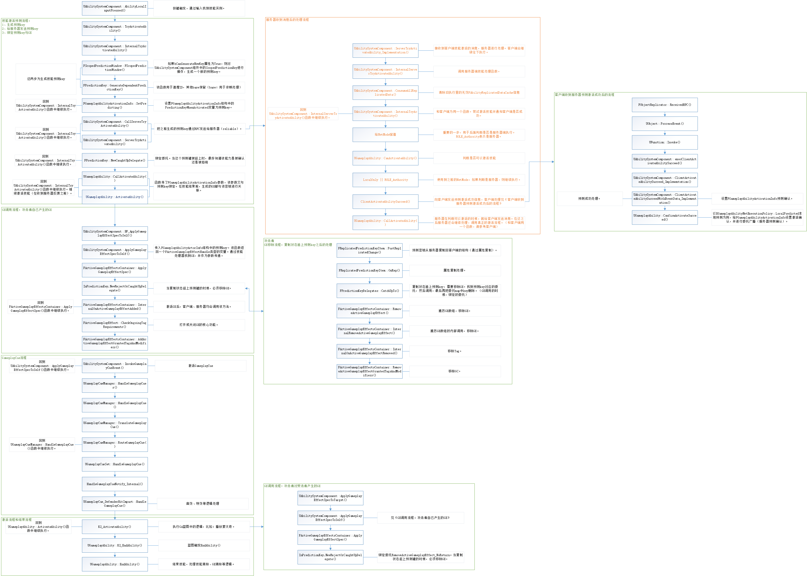

# 1 介绍

其实介绍技能系统的文章、视频已经很多了，但是由于之前学习过一段时间，所以还是想提笔总结记录一下。

GAS（GameplayAbilitySystem）是虚幻自带的一个插件。该插件易扩展、支持网络复制和预测等。

本文将介绍GAS的核心概念以及源码触发调用同步流程，重点是第4章节( •̀ ω •́ )✧。

使用的虚幻引擎版本为4.26。

（由于是之前学习的，所以有些内容可能来自于网络，但是我又忘记出处，侵删~）

# 2 学习资源

官方文档：https://docs.unrealengine.com/4.26/en-US/InteractiveExperiences/GameplayAbilitySystem/

GAS文档：https://github.com/tranek/GASDocumentation

- 最详细的文档了，还有项目进行演示查看。

Gameplay Abilities插件入门教程：https://www.cnblogs.com/JackSamuel/tag/GameplayAbility%E6%8F%92%E4%BB%B6/  

- 该教程介绍了如何在编辑器中使用Gameplay Abilities插件，如何编写技能蓝图，如何使用技能标签，如何触发技能，如何配置GameplayEffect等。

GAS插件介绍（入门篇） | 伍德 大钊：https://www.bilibili.com/video/BV1X5411V7jh

- 介绍了GAS提供了哪些功能，GAS核心概念，最后通过演示一个项目来帮助理解GAS。项目和PPT可下载。

深入GAS架构设计：https://www.bilibili.com/video/BV1zD4y1X77M

- 可以帮助理解GAS核心概念，源码架构。

官方项目及视频介绍：https://docs.unrealengine.com/4.26/en-US/Resources/SampleGames/ARPG/、https://www.bilibili.com/video/BV18J411M7jg

# 3 概念

GAS涉及的概念比较多，需要先理解核心概念，才能用好该系统。

## 3.1 ASC（UAbilitySystemComponent）

技能系统组件，是技能系统运行的核心。

负责管理协调其他部件：AbilityEffect、Attribute、Task、Event...

主要函数：

- GiveAbility()：赋予角色技能，返回技能处理器，可用于激活技能
- TryActivateAbility()：激活给定的技能
- TryActivateAbilityByClass()：通过类激活给定的技能
- TryActivateAbilitiesByTag()：通过Tag激活给定的技能

## 3.2 GA（UGameplayAbility）

定义一个技能的主体逻辑，可触发GE、GC。

主要函数：

- ActivateAbility()：激活技能
- EndAbility()：技能结束

FGameplayAbilitySpec：GA学习后的实例，定义了GA的等级等

FGameplayAbilitySpecContainer：GA实例集合

FGameplayAbilitySpecHandle：实例化GA后的处理器，可以用于获取GA实例、激活Ability等

流程：ASC通过FGameplayAbilitySpecContainer变量来管理GA实例，每一个GA实例都有一个FGameplayAbilitySpecHandle处理器成员和GA模板成员。

## 3.3 GE（UGameplayEffect）

定义游戏里一个技能的效果，可以说成Buff系统。

一般用来修改自己或别人的属性、触发GC（UGameplayCueNotify）

主要结构：

- UGameplayEffect：GE模板，用来配置数据，不会在应用到角色后进行实例化。
  - 主要变量：
    - TArray< FGameplayModifierInfo> Modifiers; // 属性修改器
    - TArray< FGameplayEffectCue>	GameplayCues; // GE触发的Cue

- FGameplayEffectSpec：GE的实例，定义了GE等级、属性修改变量等

- FActiveGameplayEffect：激活GE的实例

- FActiveGameplayEffectsContainer：激活GE的实例集合

流程：ASC通过FActiveGameplayEffectsContainer变量来管理GE实例，每次调用UGameplayEffect都会产生一个FGameplayEffectSpec实例

## 3.4 GC（UGameplayCueNotify）

定义游戏中的特效部分，如：爆炸、燃烧等

主要结构：

- UGameplayCueManager：生成FGameplayCueObjectLibrary实例，以供后续调用，减少触发时候的延迟

- UGameplayCueSet：Cue集合

流程：

- Cue在GE配置中触发或GA里调用Execute/Add触发，触发后生成实例UGameplayCueManager

- Cue触发的两种方式：
  - UGameplayCueNotify_Static
    - 不可实例化

    - static的Cue直接在CDO上调用
    - 不要在Cue里保存状态，因为它不会生成新的对象

  - AGameplayCueNotify_Actor
    - 实例化

    - 在使用的时候有时会触发Spawn生成新的实例，这些生效的Cue最终也都是在ASC里面有引用保存

## 3.5 Attribute（FGameplayAttribute）

游戏属性，如：生命值、攻击力、防御力等

主要类：

- FGameplayAttribute：描述属性数据

- UAttributeSet：属性集

流程：将UAttributeSet变量挂在Actor类中来使用

## 3.6 Tag（FGameplayTag）

可用于描述和归类一个对象的状态。可以用于判断各种状态等。

核心代码在Source\Runtime\GameplayTags\文件夹下，GameplayTags是一个单独的模块，可被单独引用。

主要类：

- UGameplayTagsManager：标签管理类，构造了标签树，描述了标签之间的关系

- FGameplayTag：Tag类，定义了标签名等

- FGameplayTagContainer：FGameplayTag集合

- FGameplayTagQuery：FGameplayTag查询

流程：该模块的入口为IGameplayTagsModule接口，通过该接口可以获取到UGameplayTagsManager（单例）类以及FGameplayTag类

## 3.7 Task（FGameplayTask）

异步操作，如：当蒙太奇播放结束后，异步结束一个技能

核心代码在AbilityTask.h、Source\Runtime\GameplayTasks\文件夹下，GameplayTasks是一个单独的模块，可被单独引用。

主要结构：UGameplayTask：GA调用

流程：

- ASC继承于UGameplayTasksComponent

- UAbilityTask继承于UGameplayTask，并添加了GA引用

## 3.8 Event（FGameplayEventData）

发送事件通知对方。可触发技能。事件靠Tag识别。

主要结构：FGameplayEventData：事件信息。

流程：注册回调，通过Tag来映射识别。当外部别的GA调用SendGameplayEvent时，会用EventTag在ASC的这个映射表里搜索，如果搜索到，就会触发回调。

## 3.9 预测（Prediction）

客户端不必等待服务器的许可就可以激活一个GameplayAbility并应用Effects。

# 4 同步流程

同步流程比较复杂，依然是以往的风格：图析~   

演示项目是GASDocument，pdf版在github上https://github.com/xiaxia9/Game-Development-Notes：流程图节点是函数，方便查看。  

我总结的流程：技能激活预测流程、服务器收到消息后的处理流程、客户端收到服务器预测激活成功后的流程、GE调用流程、GE移除流程、GC流程。

流程图很清晰，这里就不分开介绍了~

# 5 结语

GAS系统还有很多细节需要挖掘，留个坑~

水平有限，如有错误，烦请指正，谢谢吼~
